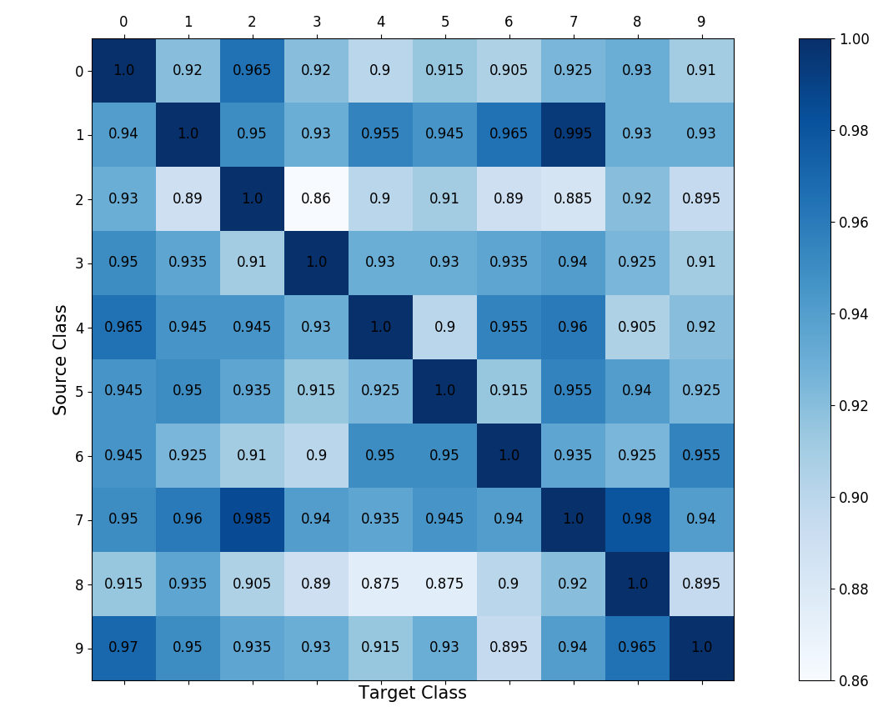
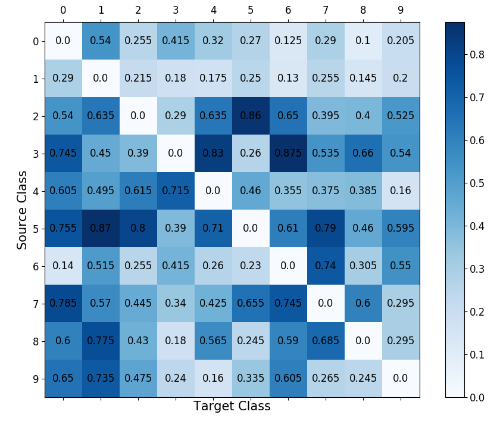

# Adversarial-Profile
### Under Develpment

## What does Adversarial Profile means:

### Dfinition 1: 

For a given CNN, adversarial profile of $i^{th}$ class ($C_i$) is a set of adversarial perturbations $\{\delta_{i,1},\cdots, \delta_{i,i-1},  \delta_{i,i+1},\cdots, \delta_{i,c} $ that satisfy the following two properties: i) adding $\delta_{i,j}$  to any clean sample from class $i$ leads the target CNN to misclassify that sample to class $j$ (i.e., if $ x\in c_i , \:\:\: \mathrm{argmax}\:\:F(x+\delta_{i,j})=j$) with high probability; and ii) adding $\delta_{i,j}$ to any clean sample from other classes ($\neq i$), would lead the CNN to  misclassify that sample to any other class except $j$ (i.e., if $ x\notin c_i , \:\:\: \mathrm{argmax} \:\:F(x+\delta_{i,j})\neq j$).

Extended Carlini Wagnar Attack for Learning Targeted and Untargeted Universal Perturbation
This attack is an extension of https://github.com/rwightman/pytorch-nips2017-attack-example 

|  | 
|:--:|:--:| 
| Intra class transferability matrix  |Inter class transferability matrix |

The element at [i,j]  in Inter class transferability matrix represents the value of p_{i,j}. Similarly,  the element at [i,j]  in intra class transferability matrix  represents the value of e_{i,j}. The larger value for p_{i,j} and lower value for e_{i,j} are preferred.
