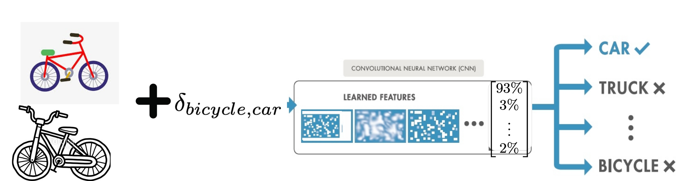

# Adversarial-Profile
### Under Develpment

## What does Adversarial Profile mean:

For a given CNN, adversarial profile of ith class (C_i) is a set of adversarial perturbations  to any clean sample from class $i$ leads the target CNN to misclassify that sample to class j (i.e., if  ) with high probability; and ii) adding  to any clean sample from other classes (except i), would lead the CNN to  misclassify that sample to any other class except $j$ (i.e., if  ). 

 

We say an adversarial perturbation   is  -intra-class transferable} if the probability of fooling CNN to the target class j for samples from source class i is   (i.e.,  ).

Although, the adversarial perturbation   is learned on source class $i$ but there is a possibility that this perturbation also works on samples from other classes (not class i). To measure transferability of an adversarial perturbation for other classes we define  Inter-Class Transferability. 

We call adversarial perturbation   is  inter-class-transferable if the probability of fooling the  CNN to the target class j for samples from other classes (not equal to i) is   (i.e., .)

|  | 
|:--:|:--:| 
| Intra class transferability matrix  |Inter class transferability matrix |

The element at [i,j]  in Inter class transferability matrix represents the value of p_{i,j}. Similarly,  the element at [i,j]  in intra class transferability matrix  represents the value of e_{i,j}. The larger value for p_{i,j}  and lower value for e_{i,j} are preferred.

## How to learn:
Finding an adversarial perturbation  () that is be able to fool all samples from class i to target class j is hard and computationally expensive. Therefore,  we only use n randomly selected samples from each source class to learn an adversarial perturbation and accept it for use in the adversarial profile if it can fool the CNN for at least p*n of them (0<p<1). 

Extended Carlini Wagnar Attack for Learning Targeted and Untargeted Universal Perturbation
This attack is an extension of https://github.com/rwightman/pytorch-nips2017-attack-example 

## How to run
### Install pythorch in a python virtual env
$python3 -m venv myenv

$source myenv/bin/activate.csh

$pip3 install torch==1.5.1+cu101 torchvision==0.6.1+cu101 -f https://download.pytorch.org/whl/torch_stable.html

### Train the CNN and Adversarial Profiles
$python3 trainmodels.py --dataset mnist

$python3 TrainAdvProfile.py --dataset mnist

Please cite A. Rajabi , R. Bobba, "Adversarial Profile: Detecting Out-distribution Samples and Adversarial Examples for Pre-trained CNNs ", DSN workshop on Dependable and Secure Machine Learning (DSML) 2019 if you used this code [slides](DSML2019.pptx)

